# Introduction
## Goal of this work

* Establish a workflow for `data.frame`.
* Discuss some ambiguities and practice the tools intrduced in this class.
* Learn to import data and using `dplyr` and `ggplot2` to do some description and visualization.

## Bring rectangular data in

Dataset for this homework is `gapminder`.
*Storing `a = gapminder` for convenience* 


```r
library(gapminder)
a = gapminder #name "gapminder" as "a" for convenience
```

Packages will be used: `tidyverse`, `ggplot2` and `gridExtra`


```r
library(tidyverse)
library(ggplot2)
library(gridExtra) #a package to arrange multigraph
```


# Data structure
I will explore some basic objects of our dataset(`gapminder`): structue ,size and type of variables.  

## Is it a *data.frame*, *matrix*, *vector* or *list*?

Command `typeof`, `class` and `mode` will be compared in this section:


```r
typeof(a)
```

```
## [1] "list"
```

```r
class(a)
```

```
## [1] "tbl_df"     "tbl"        "data.frame"
```

```r
mode(a)
```

```
## [1] "list"
```

Obviously, outputs of those 3 commands are different, even based on the same object `gapminder`. As discussed in class03, `typeof` discribes a more basic data structure like "double", "integer", while `class` and `mode`discribe a more general data structure like "numeric", "charactor".

Attached is the official description for `typeof`,`mode` and `class`:

1. `typeof`
> typeof determines the (R internal) type or storage mode of any object.

2. `mode`
> Get or set the type or storage mode of an object.

3. `class`
> R possesses a simple generic function mechanism which can be used for an object-oriented style of programming. Method dispatch takes place based on the class of the first argument to the generic function.

* `typeof` only privides the type of objects **internal** to R.
* `typeof` vs `mode`:Very similar, except for a few differences, most notably that both (typeof "integer" and "double") = (mode "numeric"); and both (typeof "special" and "builtin" = (mode "function").
* `class` is based on R's object-oriented class hierarchy, which laid out like the following graph:


There is a website disscussing [Concepts and dofference between typeof class mode](https://stackoverflow.com/questions/35445112/what-is-the-difference-between-mode-and-class-in-r)

Solution: `gapminder` is a dataframe and the reason for showing 3 values by `class` is `tbl_df` is inherited from `tbl` which is inheried from `data.frame`.


## What is its class

Based on the output shown in last section, the class of `gapminder` is `tbl_df`.

## Size of `gapminder`

There are many ways to get the size of the data, `dim` and `ncol`,`nrow` are used here.


```r
dim(a) # show the number of rows and cols
```

```
## [1] 1704    6
```

```r
c(nrow(a), ncol(a)) # ncol= number of col/nrow= number of rows
```

```
## [1] 1704    6
```

## What data type is each variable?

`str` `glimpse` can be used to show more comprehensive data structure. 


```r
str(a)
```

```
## Classes 'tbl_df', 'tbl' and 'data.frame':	1704 obs. of  6 variables:
##  $ country  : Factor w/ 142 levels "Afghanistan",..: 1 1 1 1 1 1 1 1 1 1 ...
##  $ continent: Factor w/ 5 levels "Africa","Americas",..: 3 3 3 3 3 3 3 3 3 3 ...
##  $ year     : int  1952 1957 1962 1967 1972 1977 1982 1987 1992 1997 ...
##  $ lifeExp  : num  28.8 30.3 32 34 36.1 ...
##  $ pop      : int  8425333 9240934 10267083 11537966 13079460 14880372 12881816 13867957 16317921 22227415 ...
##  $ gdpPercap: num  779 821 853 836 740 ...
```

```r
glimpse(a)
```

```
## Observations: 1,704
## Variables: 6
## $ country   <fct> Afghanistan, Afghanistan, Afghanistan, Afghanistan, ...
## $ continent <fct> Asia, Asia, Asia, Asia, Asia, Asia, Asia, Asia, Asia...
## $ year      <int> 1952, 1957, 1962, 1967, 1972, 1977, 1982, 1987, 1992...
## $ lifeExp   <dbl> 28.801, 30.332, 31.997, 34.020, 36.088, 38.438, 39.8...
## $ pop       <int> 8425333, 9240934, 10267083, 11537966, 13079460, 1488...
## $ gdpPercap <dbl> 779.4453, 820.8530, 853.1007, 836.1971, 739.9811, 78...
```

*`str` can also show the class of the dataset.*

Based on the outputs, we have:

| **Variables**| **data type**|
|----------|-----------|
|`country`| Factor|
|`continent`| Factor|
|`year`| int|
|`lifeExp`|num|
|`pop`|int|
|`gdpPercap`|num|

There is another frequently used function `summary`, which is used to show some general statistical fewture of dataset.


```r
summary(a)
```

```
##         country        continent        year         lifeExp     
##  Afghanistan:  12   Africa  :624   Min.   :1952   Min.   :23.60  
##  Albania    :  12   Americas:300   1st Qu.:1966   1st Qu.:48.20  
##  Algeria    :  12   Asia    :396   Median :1980   Median :60.71  
##  Angola     :  12   Europe  :360   Mean   :1980   Mean   :59.47  
##  Argentina  :  12   Oceania : 24   3rd Qu.:1993   3rd Qu.:70.85  
##  Australia  :  12                  Max.   :2007   Max.   :82.60  
##  (Other)    :1632                                                
##       pop              gdpPercap       
##  Min.   :6.001e+04   Min.   :   241.2  
##  1st Qu.:2.794e+06   1st Qu.:  1202.1  
##  Median :7.024e+06   Median :  3531.8  
##  Mean   :2.960e+07   Mean   :  7215.3  
##  3rd Qu.:1.959e+07   3rd Qu.:  9325.5  
##  Max.   :1.319e+09   Max.   :113523.1  
## 
```

For factor variables, we can see the number of data in each catogory; for numeric variables, we can see some basic numeric property.

# Explore individual variables

In this section, I will choose some catogorical variables and quantitive variables from `gapminder` to explore. From last section, we already know that there are 2 categorical variables `country` and `continent` in the dataset, except for which are numerical.


## Explore catogorical variable: `continent`

First of all, selecting `continent` from `gapminder` and using `table` funciton to get build a contigency table of continent data.

*Storing continent as con for convenience*

```r
#store continent as con for convenience
con = select(a, continent) 
table(con)
```

```
## con
##   Africa Americas     Asia   Europe  Oceania 
##      624      300      396      360       24
```

```r
#summay is also usful to see some basic info of catogorical data
summary(con)
```

```
##     continent  
##  Africa  :624  
##  Americas:300  
##  Asia    :396  
##  Europe  :360  
##  Oceania : 24
```

We can see that there are 5levels under `continent`.


```r
#using barplot to visualize the data
p1 = barplot(table(con))
```

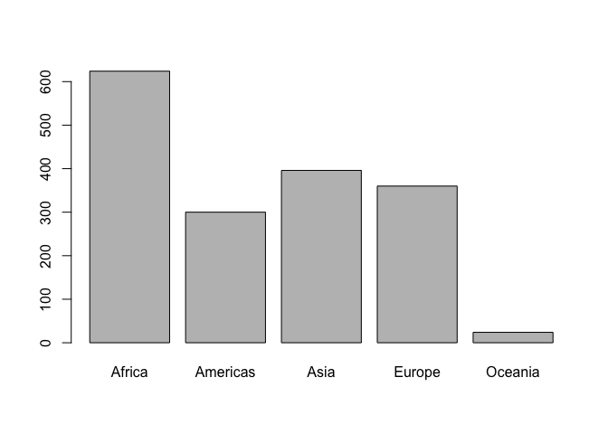<!-- -->

```r
# we can also use ggplot2 package to see the bar plot
ggplot(con,aes(continent)) +
  geom_bar(fill="cornflowerblue",color="black") + #bar plot
  labs(title="Continent data", x="continent",y="numbers") 
```

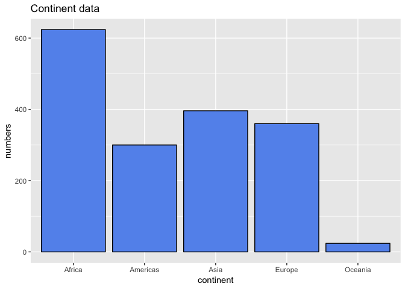<!-- -->

```r
# Moover, we can change the y-axis to the proportion
 #add y=..count../sum(..count..) aesthetic
ggplot(con,aes(continent,..count../sum(..count..))) +
  geom_bar() + #bar plot
  labs(title="Continent data", x="continent",y="proportion") +
  theme_gray()
```

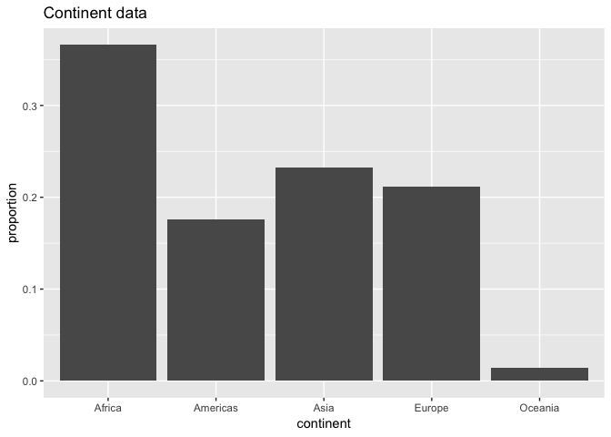<!-- -->


Now we clearly see the level and the distribution of `continent`, lets head up to quantitive data.


## Explore the quantitive data:`lifeExp` 

Firstly, I will select those two variables and to see some summary statistics such as quantiles and ranges.


```r
a %>% 
  select(lifeExp) %>% 
  summary() %>% 
knitr::kable() # create table
```

        lifeExp    
---  --------------
     Min.   :23.60 
     1st Qu.:48.20 
     Median :60.71 
     Mean   :59.47 
     3rd Qu.:70.85 
     Max.   :82.60 

Then, to reach more information about the variable, I will choose a histogram combined with a kernal density plot to show the distribution of data.


```r
ggplot(a,aes(lifeExp)) +
  geom_histogram(aes(y=..density..), alpha=0.8,binwidth = 5) +
  geom_density(bw=2)
```

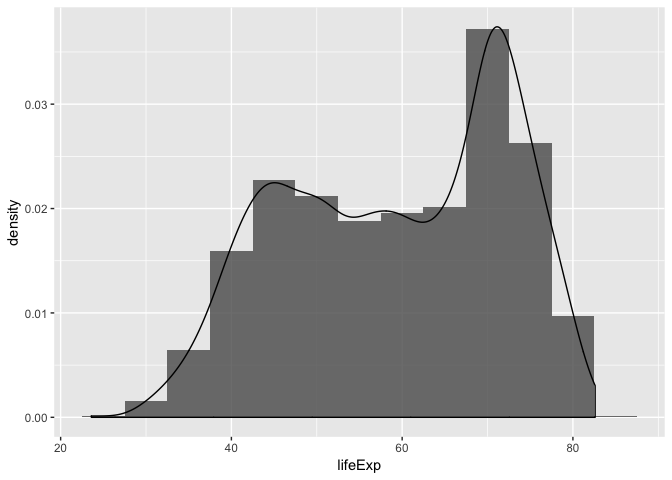<!-- -->

From the output, we can see the peak occures around 70.

Now we want to see the normality of `lifeExp`, using `qqplot`


```r
qqnorm(a$lifeExp, pch = 1, frame = FALSE)
```

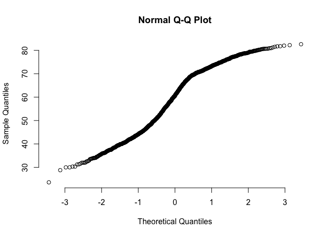<!-- -->


# Explore various plot type

## Explore data with groups

In this section, we are going to see how to using `ggplot` to explore data by group. Obviously, life expectancy is highly rekated to country and continent. Therefore, I addressed series of boxplot under different countries and group theme by continent.


```r
#boxplot, factored by country, grouped by continent
ggplot(a,aes(country,lifeExp,color=continent,shape=continent))+
  geom_boxplot()+
  facet_grid(continent~.)
```

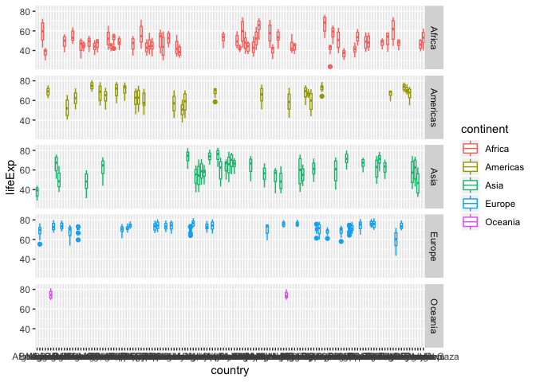<!-- -->


We can see that it is not sensible to assume `lifeExp` is normal. Actually, it is quite reasonable, since there will be some reginal variation.

In Europe, the life expectancy in each country is pretty high and is consistent, while the data of Asia showed huge variation between countries. Generally speaking, Europe and Oceania have high life expectancy of their citizens and the spread of the life time is more concentrated, based on samller IQR.

Looking at other 3 continent, there are huge regianl variations and people's life expectancy are more widely spread. 

More generally, I will use a boxplot to illustrate this conclusion.


```r
#scatter plot + boxplot + violin, factored by continent
ggplot(a,aes(continent,lifeExp))+
 geom_violin(fill="cornflowerblue")+
 geom_boxplot(fill= "lightblue",width=0.5,alpha=0.5,notch=TRUE)+
  geom_point(position = "jitter", color= "black" ,alpha =0.4)
```

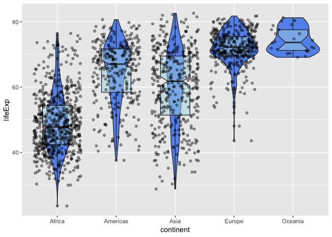<!-- -->


Then I am going to explore 2 quantitive variables `lifeExp`and `gdpPercap`, since intuitively life expectancy should be realted to citizen's wealth level.


```r
#scatter plot factored by continent 
ggplot(a,aes(gdpPercap,lifeExp, color= continent, shape= continent))+
  geom_point()
```

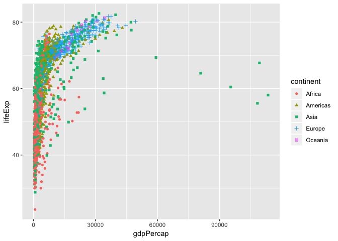<!-- -->


Generally speaking, higher gdp per capita tends to lead to longer longevity but there are some outliers in Aisa, which shows extremly high gdp percapita but with only average life expectancy.

Due to this scatter plot, we can also see the distribution of `lifeExp` and `gdpPercap` in each continent. Besides, we can expore the density plot of `gdpPercap` in each continent.


```r
#multiple density lines grouped by continent
ggplot(a, aes(gdpPercap, fill= continent)) +
  geom_density(alpha=0.3)
```

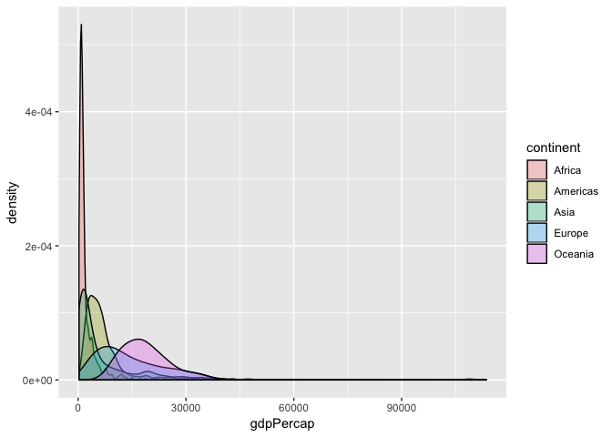<!-- -->

we can see in Afica, people have lower gdp percapita and smaller variarion while oceania have wider spread.

# Use `filter `, `select` and ` %>% `

To see the tendency of life expectancy in canada.


```r
#filter all canada data, line plot of life expectancy in canada
a %>% 
  filter(country =="Canada") %>% 
  ggplot(aes(year,lifeExp)) + 
  geom_line() + 
  geom_point()+
  theme_bw()+
  labs(title="Life expectancy in Canada", y="longevity")
```

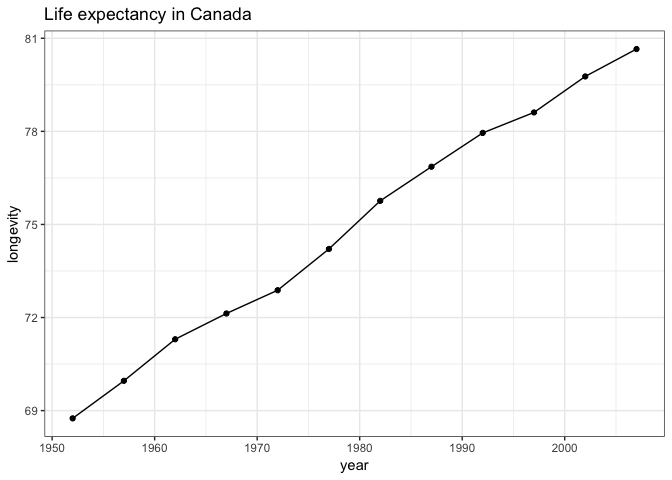<!-- -->

It's obviously that people's life expectancy in Canada keep increasing from 1950 to 2007.

Now let's explore from Euro and Asia


```r
# select and filter data from Euro and Asia, concentrate on the year after 1980
h = a%>% 
    select(lifeExp, gdpPercap,year,continent) %>% 
    filter(continent %in% c("Europe","Asia") & year>=1980 )
    
#scatter plot of lifeezp in EURO and ASIA
h %>% 
  ggplot(aes(year,lifeExp,color = continent, shape = continent))+ 
  geom_point(alpha=0.8)+
  scale_x_continuous(breaks=c(1982,1987,1992,1997,2002,2007),labels=c("1982","1987","1992","1997","2002","2007"))+
  labs(title=" Comparing life expectancy in Aisa and Euro in recent years")
```

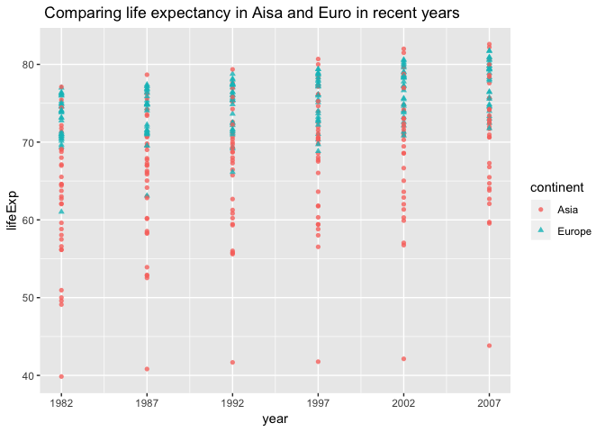<!-- -->

We can defitely reach the conclusion that people have higher life expectancy in Euro than in Asia. In the meanwhile, data of both continents have a rising tendency in life expectany.


```r
#Comparing GDPpercap in Aisa and Euro in recent year
h %>% 
  ggplot(aes(year,gdpPercap,color = continent, shape = continent))+ 
  geom_point(alpha=0.8)+
  scale_x_continuous(breaks=c(1982,1987,1992,1997,2002,2007),labels=c("1982","1987","1992","1997","2002","2007"))+
  labs(title=" Comparing GDPpercap in Aisa and Euro in recent year")
```

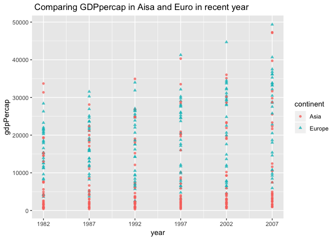<!-- -->

Basically, it shows the same properties with lifeExp. Therefore, we can sensibly think there are some realationships between `lifeExp` and `gdpPercap`. Actually, I addressed a scatterplot for thhose two variables in last section, but it used raw dataset `gapminder`,which has many continents and the results are vogue. In this section, I will concentrate on Asia and Euro.


```r
#Relation between lifeexp and gdppercap
h %>% 
  ggplot(aes(gdpPercap,lifeExp,color =continent,shape=continent))+
  geom_smooth() + geom_point(alpha=0.5)+
  facet_grid(continent~.)+
  labs(title="Relation between lifeexp and gdppercap")
```

```
## `geom_smooth()` using method = 'loess' and formula 'y ~ x'
```

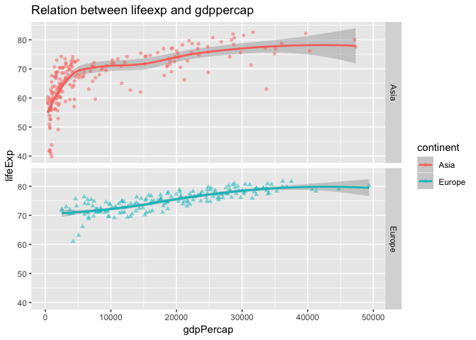<!-- -->


In Asia, it is not a simple linear relationship, especially in the former part, while in Euro, the relationship is pretty clearly, which is almost linear.

# But I Want to do More!

In this section, I will explore this piece of code whose aim is to get all subsets of data contains Rwanda or afghanistan:

```
filter(gapminder, country == c("Rwanda", "Afghanistan"))
```

First of all, let's figurte out if it is correct.


```r
#etract col of country
country=select(a, country)
summary(country)
```

```
##         country    
##  Afghanistan:  12  
##  Albania    :  12  
##  Algeria    :  12  
##  Angola     :  12  
##  Argentina  :  12  
##  Australia  :  12  
##  (Other)    :1632
```

```r
#filter Rwanda
filter(country, country == "Rwanda") %>% 
  summary()
```

```
##         country  
##  Rwanda     :12  
##  Afghanistan: 0  
##  Albania    : 0  
##  Algeria    : 0  
##  Angola     : 0  
##  Argentina  : 0  
##  (Other)    : 0
```

```r
#given code
filter(gapminder, country == c("Rwanda", "Afghanistan")) %>% 
  summary()
```

```
##         country     continent      year         lifeExp     
##  Afghanistan:6   Africa  :6   Min.   :1952   Min.   :23.60  
##  Rwanda     :6   Americas:0   1st Qu.:1966   1st Qu.:37.33  
##  Albania    :0   Asia    :6   Median :1980   Median :41.29  
##  Algeria    :0   Europe  :0   Mean   :1980   Mean   :39.17  
##  Angola     :0   Oceania :0   3rd Qu.:1993   3rd Qu.:43.52  
##  Argentina  :0                Max.   :2007   Max.   :46.22  
##  (Other)    :0                                              
##       pop             gdpPercap    
##  Min.   : 2534927   Min.   :493.3  
##  1st Qu.: 5128704   1st Qu.:625.9  
##  Median : 8546668   Median :785.9  
##  Mean   :11156086   Mean   :749.3  
##  3rd Qu.:14121061   3rd Qu.:840.2  
##  Max.   :31889923   Max.   :974.6  
## 
```


We can see that  there are 12 data for Afghanistan and Rwanda respectively, rather than  6 shown in the goven code. This code doesn't get all the data for Afghanistan and Rwand, since it doesn't compare each data in country to "Afghanistan" and "Rwanda", and excute logical operation `or`. It actually compare the odd row to Afghanistan and even row to Rwanda.

The correct way to get all thhe data for "Afghanistan" and "Rwanda" is:


```r
#using %in%
gapminder %>% 
  filter(country %in% c("Afghanistan","Rwanda"))%>%
  knitr::kable()
```


country       continent    year   lifeExp        pop   gdpPercap
------------  ----------  -----  --------  ---------  ----------
Afghanistan   Asia         1952    28.801    8425333    779.4453
Afghanistan   Asia         1957    30.332    9240934    820.8530
Afghanistan   Asia         1962    31.997   10267083    853.1007
Afghanistan   Asia         1967    34.020   11537966    836.1971
Afghanistan   Asia         1972    36.088   13079460    739.9811
Afghanistan   Asia         1977    38.438   14880372    786.1134
Afghanistan   Asia         1982    39.854   12881816    978.0114
Afghanistan   Asia         1987    40.822   13867957    852.3959
Afghanistan   Asia         1992    41.674   16317921    649.3414
Afghanistan   Asia         1997    41.763   22227415    635.3414
Afghanistan   Asia         2002    42.129   25268405    726.7341
Afghanistan   Asia         2007    43.828   31889923    974.5803
Rwanda        Africa       1952    40.000    2534927    493.3239
Rwanda        Africa       1957    41.500    2822082    540.2894
Rwanda        Africa       1962    43.000    3051242    597.4731
Rwanda        Africa       1967    44.100    3451079    510.9637
Rwanda        Africa       1972    44.600    3992121    590.5807
Rwanda        Africa       1977    45.000    4657072    670.0806
Rwanda        Africa       1982    46.218    5507565    881.5706
Rwanda        Africa       1987    44.020    6349365    847.9912
Rwanda        Africa       1992    23.599    7290203    737.0686
Rwanda        Africa       1997    36.087    7212583    589.9445
Rwanda        Africa       2002    43.413    7852401    785.6538
Rwanda        Africa       2007    46.242    8860588    863.0885

```r
#another way by using logical opration
gapminder %>% 
  filter(country == "Afghanistan" | country ==  "Rwanda") %>%
  knitr::kable()
```


country       continent    year   lifeExp        pop   gdpPercap
------------  ----------  -----  --------  ---------  ----------
Afghanistan   Asia         1952    28.801    8425333    779.4453
Afghanistan   Asia         1957    30.332    9240934    820.8530
Afghanistan   Asia         1962    31.997   10267083    853.1007
Afghanistan   Asia         1967    34.020   11537966    836.1971
Afghanistan   Asia         1972    36.088   13079460    739.9811
Afghanistan   Asia         1977    38.438   14880372    786.1134
Afghanistan   Asia         1982    39.854   12881816    978.0114
Afghanistan   Asia         1987    40.822   13867957    852.3959
Afghanistan   Asia         1992    41.674   16317921    649.3414
Afghanistan   Asia         1997    41.763   22227415    635.3414
Afghanistan   Asia         2002    42.129   25268405    726.7341
Afghanistan   Asia         2007    43.828   31889923    974.5803
Rwanda        Africa       1952    40.000    2534927    493.3239
Rwanda        Africa       1957    41.500    2822082    540.2894
Rwanda        Africa       1962    43.000    3051242    597.4731
Rwanda        Africa       1967    44.100    3451079    510.9637
Rwanda        Africa       1972    44.600    3992121    590.5807
Rwanda        Africa       1977    45.000    4657072    670.0806
Rwanda        Africa       1982    46.218    5507565    881.5706
Rwanda        Africa       1987    44.020    6349365    847.9912
Rwanda        Africa       1992    23.599    7290203    737.0686
Rwanda        Africa       1997    36.087    7212583    589.9445
Rwanda        Africa       2002    43.413    7852401    785.6538
Rwanda        Africa       2007    46.242    8860588    863.0885


